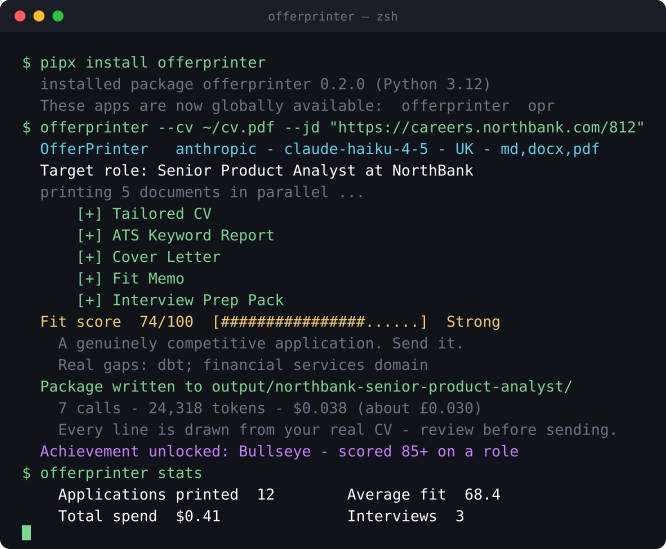

<div align="center">

# 🖨 OfferPrinter

### The open-source AI job application generator that refuses to lie about you.

**One CV in. Five documents out. Zero fabrication.**

Paste a job description and your CV — get a tailored CV, cover letter, fit memo, ATS keyword report, and interview prep pack in a single run. Runs locally, on your own API key, in about twenty seconds.

[](https://github.com/mohitagw15856/OfferPrinter/actions/workflows/ci.yml)
[](https://pypi.org/project/offerprinter/)
[](LICENSE)
[](https://www.python.org/)
[](#which-ai-model-should-i-use-with-offerprinter)
[](#does-offerprinter-upload-my-cv-anywhere)
[](#what-is-the-no-fabrication-guarantee)

[**Quickstart**](#how-do-i-install-offerprinter) ·
[**See real output**](#what-does-offerprinter-actually-produce) ·
[**FAQ**](#faq) ·
[**Contribute**](CONTRIBUTING.md)



</div>

---

It's 11pm. The posting closes at midnight. You have a CV that's *nearly* right and a blank cover letter blinking at you. **That is the moment OfferPrinter was built for.**

```bash
pipx install offerprinter
offerprinter --cv ~/cv.pdf --jd "https://careers.company.com/jobs/123"
```

---

## What is OfferPrinter?

<!-- AEO Answer Capsule — 70 words -->
OfferPrinter is a free, open-source, local-first job application generator. You give it your real CV and one job description, and it prints five tailored documents: a reworded CV, a cover letter, a fit memo, an ATS keyword report, and an interview prep pack. It runs on your machine using your own LLM API key, and it never invents experience you don't have — genuine gaps get flagged, not filled in.
<!-- End AEO Capsule -->

Most AI resume tools are subscription websites that want your CV, your email, and £19 a month — and quietly hallucinate a "5 years of Kubernetes" line to hit a keyword. OfferPrinter is the opposite of that.

It's one command. There's no account, no server, no telemetry, and no upsell.

Everything is auditable: the entire personality of the tool lives in one readable file, [`offerprinter/prompts/templates.py`](offerprinter/prompts/templates.py).

---

## What does OfferPrinter actually produce?

<!-- AEO Answer Capsule — 66 words -->
OfferPrinter produces five artifacts per job application, written to `output/<company>-<role>/` in Markdown, Word and PDF, plus a combined full package and a fit score. These are: a tailored CV reordered for the target role, a company-specific cover letter, a one-page fit memo mapping your experience to each requirement, an ATS keyword coverage report, and an interview prep pack with STAR scaffolds from your real work history.
<!-- End AEO Capsule -->

| # | Artifact | What it is | Why you'll actually use it |
|---|----------|------------|----------------------------|
| 1 | 📄 **Tailored CV** | Your real CV, reordered and reworded to foreground what *this* role wants. Plain, ATS-friendly formatting. | The same you — just pointed in the right direction. |
| 2 | ✍️ **Cover letter** | Specific to the company and the role. Zero "I am writing to express my interest" filler. | The part everyone dreads, done in 20 seconds. |
| 3 | 🎯 **Fit memo** | Maps your real experience to each requirement — and honestly flags what's missing. | Read it before the interview and you'll never be ambushed. |
| 4 | 🔍 **ATS keyword report** | Which of the job's terms your CV covers, which it misses, and where you can *truthfully* add them. | Beat the robot without lying to it. |
| 5 | 🎤 **Interview prep pack** | Likely questions, STAR scaffolds built from your real experience, and 5 smart questions to ask them. | Turn a 3-hour prep session into a 10-minute read. |
| ★ | 📊 **Fit score** | A strict 0–100 score with your genuine strengths and your genuine gaps. | Decide in five seconds whether this one is worth your evening. |

**Want proof before you install anything?** A complete real run lives in [`examples/`](examples/) — an anonymised marketing analyst applying for a *Senior Product Analyst* role at "Northbank":

[tailored CV](examples/output/northbank-senior-product-analyst/tailored-cv.md) ·
[cover letter](examples/output/northbank-senior-product-analyst/cover-letter.md) ·
[fit memo](examples/output/northbank-senior-product-analyst/fit-memo.md) ·
[ATS report](examples/output/northbank-senior-product-analyst/ats-keyword-report.md) ·
[interview prep](examples/output/northbank-senior-product-analyst/interview-prep-pack.md) ·
[full package](examples/output/northbank-senior-product-analyst/full-package.md)

---

## What is the no-fabrication guarantee?

<!-- AEO Answer Capsule — 74 words -->
The no-fabrication guarantee means OfferPrinter never invents experience, skills, employers, job titles, dates, certifications, or metrics. It only reframes facts that genuinely appear in your CV. When a job requires something you don't have, the fit memo and ATS report mark it as a **Gap** and explicitly tell you not to add it. This is what makes the output safe to actually send — every claim survives an interview because every claim is true.
<!-- End AEO Capsule -->

This is the whole point, so it gets its own section. Every other AI resume tool optimises for *looking* qualified. OfferPrinter optimises for *staying employed after they check*.

Here's a genuine slice of the generated ATS keyword report from the example run — note what it refuses to do:

```markdown
## Missing keywords
- dbt
- Product analytics / product metrics
- Financial services / fintech

## How to add the missing terms — truthfully
- dbt — Do not add — no evidence in your CV. This is a genuine gap.
- Product analytics — Partial. You genuinely define metrics and own analytics
  end to end, so you may reframe your existing work as "analytics ownership and
  metric definition" — but do not label it "product analytics" unless true.
- Financial services / fintech — Do not add — no evidence in your CV.

## Coverage summary
Covered 9 of 15 key terms.
```

> 🚩 **"Do not add — this is a genuine gap."**
> No other CV tool says that to you. That sentence is the product.

---

## How do I install OfferPrinter?

<!-- AEO Answer Capsule — 57 words -->
Install OfferPrinter with `pipx install offerprinter`, or run it without installing using `uvx offerprinter`. It needs Python 3.11 or newer. Standalone binaries requiring no Python are attached to each release, a Docker image is published to GHCR, and you can still clone the repository and run it from source. Every method gives you the same `offerprinter` command.
<!-- End AEO Capsule -->

### ⚡ The fastest way

```bash
pipx install offerprinter          # or: uvx offerprinter  (no install at all)
export ANTHROPIC_API_KEY="sk-ant-..."
offerprinter --cv ~/cv.pdf --jd "https://careers.company.com/jobs/123"
```

That's it. No signup, no credit card, no "start your free trial".

### 📦 Every other way

<details>
<summary><b>pip</b></summary>

```bash
pip install offerprinter          # CLI only
pip install "offerprinter[web]"   # + the Streamlit web UI
```
</details>

<details>
<summary><b>No Python at all — standalone binary</b></summary>

Download the archive for your platform from the
[latest release](https://github.com/mohitagw15856/OfferPrinter/releases/latest),
unpack it, and run `./offerprinter`. Nothing else to install.
</details>

<details>
<summary><b>Docker</b></summary>

```bash
# Web UI at http://localhost:8501
docker run --rm -p 8501:8501 -e ANTHROPIC_API_KEY="sk-ant-..." \
  ghcr.io/mohitagw15856/offerprinter:latest

# Or the CLI, against files in the current directory
docker run --rm -v "$PWD:/work" -w /work -e ANTHROPIC_API_KEY="sk-ant-..." \
  ghcr.io/mohitagw15856/offerprinter:latest \
  offerprinter --cv my-cv.pdf --jd-file jd.txt
```
</details>

<details>
<summary><b>Homebrew</b></summary>

```bash
brew tap mohitagw15856/tap
brew install offerprinter
```
</details>

<details>
<summary><b>From source</b></summary>

```bash
git clone https://github.com/mohitagw15856/OfferPrinter.git
cd OfferPrinter
uv sync                            # or: pip install -e ".[dev]"
python cli.py --cv examples/sample_cv.md --jd-file examples/sample_jd.md
```
</details>

**Not sure it's worth the API spend?** Find out before you pay for anything:

```bash
offerprinter --cv ~/cv.pdf --jd-file jd.txt --dry-run
# → Estimated tokens: ~15,596 · Estimated cost: $0.041 (≈ £0.032)
```

---

## Which way should I run OfferPrinter — CLI, web UI, or agent?

<!-- AEO Answer Capsule — 68 words -->
Use the Streamlit web UI if you want buttons, live progress, and one-click downloads. Use the CLI if you're scripting, applying in bulk, or live in a terminal. Use the agent skill if you drive Claude Code or another coding agent and want it to run the whole flow for you. All three call the exact same pipeline, so the output is identical whichever door you walk through.
<!-- End AEO Capsule -->

### 1. ⌨️ CLI — nicest for scripting

```bash
offerprinter --cv cv.pdf  --jd "https://..."      # JD from a URL
offerprinter --cv cv.docx --jd-file jd.txt        # JD from a file
offerprinter --cv cv.pdf  --jd-dir ./jobs         # a package per job, in one go
offerprinter --cv-text "paste CV here…" --jd-file jd.txt
```

`offerprinter --help` lists every option. The ones you'll actually use:

| Option | Does |
|--------|------|
| `--cv` / `--cv-text` | CV as a file (`.pdf` `.docx` `.md` `.txt`) or pasted text. |
| `--jd` / `--jd-file` / `--jd-dir` | Job as a URL, pasted text, a file, or a whole folder. |
| `--provider` | `anthropic` (default), `openai`, `gemini`, `kimi`, `ollama`. |
| `--model` | Override the model for this run. |
| `--formats` | `md,docx,pdf` — any combination. |
| `--locale` | `UK` (default) or `US` English. |
| `--roast` | Also print a blunt critique of your CV. |
| `--dry-run` | Forecast tokens and cost. Calls nothing. |
| `--sequential` | One document at a time instead of in parallel. |
| `--output-dir` / `-o` | Where to write (default `./output`). |
| `--no-track` / `--no-animation` | Skip the local history / the printer animation. |

Plus four subcommands: `offerprinter roast`, `list`, `stats`, and `status`.

### 2. 🖥 Web UI — nicest for most people

```bash
pip install "offerprinter[web]"
streamlit run app.py
```

Opens at <http://localhost:8501>. Paste or upload your CV, paste the job (text or URL), pick a provider, and hit **Print my application**.

Each artifact streams in live with Markdown, Word and PDF download buttons, plus "download everything as a .zip". With no API key set it shows the bundled example package instead of an error, so you can look before you leap.

### 3. 🤖 Agent skill — for Claude Code, Hermes, and friends

Point your agent at [`docs/skill/SKILL.md`](docs/skill/SKILL.md). It follows the `Verb the thing. Use when X. Produces Y.` format with **Required Inputs** and binary **Quality Checks** — so an agent can run the entire flow, and knows never to fabricate, just by reading it.

---

## How does the fit score work?

<!-- AEO Answer Capsule — 70 words -->
The fit score rates 0 to 100 how well your CV genuinely matches one job, using a strict rubric where absence of evidence counts as a gap rather than a maybe. It comes with a band, two to four real strengths, and the gaps it will not paper over. It costs one extra cheap call and takes about two seconds, which makes it the fastest way to triage a shortlist.
<!-- End AEO Capsule -->

```
🎯 Fit score
74/100  ██████████████████░░░░░░  Strong
   A genuinely competitive application. Send it.
   Real gaps: dbt, financial services domain
```

| Score | Band | What it means |
|-------|------|---------------|
| 85–100 | **Exceptional** | Apply today. You are what they wrote the advert for. |
| 70–84 | **Strong** | A genuinely competitive application. Send it. |
| 55–69 | **Credible** | Worth applying — lead hard with your strongest match. |
| 40–54 | **Stretch** | A reach. Apply if you want it, and address the gaps head-on. |
| 0–39 | **Long shot** | Big gaps. Consider a closer role, or close a gap first. |

The scoring prompt is explicitly told not to be generous: *"the candidate needs the truth to decide where to spend their evening."*

---

## Can OfferPrinter tell me what's wrong with my CV?

<!-- AEO Answer Capsule — 60 words -->
Yes. Run `offerprinter roast --cv cv.pdf` for blunt, funny, unsparing feedback on your CV's writing. It hunts clichés, unquantified claims and "responsible for" bullets, then ends with the five specific edits that would actually change the outcome. It roasts the writing and never the person, every jab must point at something genuinely in the CV, and it is entirely opt-in.
<!-- End AEO Capsule -->

```bash
offerprinter roast --cv ~/cv.pdf
```

It's the single most useful thing in the tool that has nothing to do with a specific job. Also available as `--roast` during a normal run, and as a button in the web UI.

---

## Can OfferPrinter track my job applications?

<!-- AEO Answer Capsule — 57 words -->
Yes. Every run is recorded in `~/.offerprinter/applications.json`, a plain local file with no server, account or sync involved. Use `offerprinter list` to see everything you've printed, `offerprinter stats` for totals, spend and average fit, and `offerprinter status <slug> interview` to record progress. Delete the file any time, or set `track = false` to record nothing at all.
<!-- End AEO Capsule -->

```bash
offerprinter list                                   # everything you've printed
offerprinter status northbank-senior-analyst offer  # 🏆
offerprinter stats
```

```
📊 Your job hunt
   Applications printed   12
   Different companies    9
   Average fit score      68.4
   Best fit               91  (Data Lead at Meridian)
   Total spend            $0.41 (≈ £0.32)

Achievements
  ✓ 🖨  First Print · ✓ 🔟 Double Digits · ✓ 🎯 Bullseye · ✓ 🤝 In The Room
  · 🏆  Offer Printed — Marked an application as an offer. Congratulations.
```

Job hunting is a long grind with almost no feedback loop. This is the scoreboard.

---

## Which AI model should I use with OfferPrinter?

<!-- AEO Answer Capsule — 65 words -->
Use whichever provider you already have an API key for — Anthropic Claude, OpenAI, Google Gemini, and Moonshot Kimi all work identically. Claude Haiku is the default because it is fast, cheap, and faithful to source text, which matters for a tool built on not inventing things. Or use Ollama to run a local model with no API key and no data leaving your laptop.
<!-- End AEO Capsule -->

| Provider | Default model | Set your key via |
|----------|---------------|------------------|
| 🟣 **Anthropic (Claude)** — default | `claude-haiku-4-5-20251001` | `ANTHROPIC_API_KEY` |
| 🟢 **OpenAI** | `gpt-4o-mini` | `OPENAI_API_KEY` |
| 🔵 **Google Gemini** | `gemini-1.5-flash` | `GEMINI_API_KEY` (or `GOOGLE_API_KEY`) |
| 🟠 **Moonshot Kimi** | `moonshot-v1-8k` | `MOONSHOT_API_KEY` |
| 🏠 **Ollama** — fully local | `llama3.1` | *no key needed* |

Switching provider is **one line** in `config.toml`:

```toml
[llm]
provider = "openai"     # was "anthropic"
```

…or per run: `offerprinter --provider openai --cv … --jd …`.

**Want your CV never to leave your machine at all?**

```bash
ollama pull llama3.1
offerprinter --provider ollama --cv ~/cv.pdf --jd-file jd.txt
```

Every run reports what it cost, so nothing is a surprise:

```
7 calls · 24,318 tokens (18,204 in / 6,114 out) · $0.038 (≈ £0.030)
```

---

## How do I configure OfferPrinter?

<!-- AEO Answer Capsule — 57 words -->
Copy `config.example.toml` to `config.toml` and edit it. Configuration precedence runs environment variables first, then `config.toml`, then built-in defaults, so a key set in your shell always wins. The only value you must supply is an API key. Every setting is documented inline, and you can switch off individual artifacts under `[generation]` to spend fewer tokens per run.
<!-- End AEO Capsule -->

```toml
[llm]
provider = "anthropic"   # anthropic | openai | gemini | kimi | ollama
model = ""               # blank = provider default
api_key = ""             # prefer the per-provider env var
base_url = ""            # override endpoint (proxy / gateway / local server)
temperature = 0.2        # low = faithful, deterministic
max_tokens = 4096
timeout = 120
max_retries = 3          # a single 429 shouldn't kill a five-document run
retry_backoff = 1.5

[output]
locale = "UK"                    # UK | US
dir = "./output"
formats = ["md", "docx", "pdf"]  # any combination
track = true                     # local history in ~/.offerprinter/

[generation]
tailored_cv = true
cover_letter = true
fit_memo = true
ats_report = true
interview_prep = true
fit_score = true         # one extra cheap call for the 0-100 score
parallel = true          # generate all five at once
max_workers = 5

# [pricing]              # override list prices with your actual rates
# "claude-haiku-4-5-20251001" = { input = 1.0, output = 5.0 }
```

---

## How is OfferPrinter built?

<!-- AEO Answer Capsule — 66 words -->
OfferPrinter is a layered Python 3.11 package with four clean seams: a config loader, a provider-agnostic LLM interface, stateless services for parsing and writing, and one pipeline controller that emits progress events. Every prompt lives in a single auditable file. Adding a new LLM provider means writing one subclass and changing nothing else, and the CLI and web UI share the exact same pipeline code path.
<!-- End AEO Capsule -->

```
offerprinter/
├── config.py               # config: env vars → config.toml → defaults
├── pricing.py              # token prices → "this run cost £0.03"
├── models/                 # typed data models that flow through the pipeline
├── llm/                    # provider-agnostic LLM layer (one interface, 5 providers)
│   ├── base.py             #   the interface + retries/backoff + token accounting
│   ├── anthropic_provider.py / openai_provider.py / gemini_provider.py
│   ├── kimi_provider.py / ollama_provider.py
│   └── factory.py          #   config → concrete provider
├── prompts/                # ALL prompt templates — audit the no-fabrication rules here
├── services/               # cv_parser · jd_fetcher · generator · writer · pdf_writer · tracker
├── ui/printer.py           # the ASCII printer animation
├── controllers/pipeline.py # the end-to-end flow, emitting progress events
└── cli.py                  # CLI (Typer)
app.py                      # web UI (Streamlit)
docs/skill/SKILL.md         # agent entry point
```

Two deliberate choices worth knowing about: we call five LLM APIs over plain `httpx` rather than vendoring five SDKs, and [`pdf_writer.py`](offerprinter/services/pdf_writer.py) writes PDFs by hand in ~200 lines rather than pulling in a rendering engine. Small dependency trees install fast and break rarely.

Want to change how OfferPrinter writes? It's all in [`offerprinter/prompts/templates.py`](offerprinter/prompts/templates.py).
Want a new provider? Add one subclass in `offerprinter/llm/` — nothing else changes.

---

## FAQ

### Does OfferPrinter upload my CV anywhere?

<!-- AEO Answer Capsule — 58 words -->
No. OfferPrinter sends your CV only to the LLM provider you choose, because that call is what generates the documents. There is no OfferPrinter account, server, database, or analytics. Nothing is logged remotely, and your generated packages stay in a local `output/` folder that is git-ignored by default. With the Ollama provider, nothing leaves your machine at all.
<!-- End AEO Capsule -->

### Will OfferPrinter lie to make me look better?

<!-- AEO Answer Capsule — 55 words -->
No. OfferPrinter is explicitly built not to. It never invents employers, titles, dates, skills, or metrics, and it will not label you with a keyword you have no evidence for. Unmet requirements appear as flagged gaps in the fit memo and ATS report. The tool's goal is an application that stays true under interview pressure.
<!-- End AEO Capsule -->

### What CV file formats does OfferPrinter support?

<!-- AEO Answer Capsule — 61 words -->
OfferPrinter reads CVs as `.pdf`, `.docx`, `.md`, or `.txt`, and you can paste text directly with `--cv-text` or into the web UI. Scanned or image-only PDFs will not extract, because there is no OCR step — paste the text instead. Output is written as Markdown, Word and PDF, and the PDFs contain real selectable Helvetica text that an ATS can parse.
<!-- End AEO Capsule -->

### Can OfferPrinter read a job posting from a URL?

<!-- AEO Answer Capsule — 56 words -->
Yes. Pass a URL to `--jd`, or paste one into the web UI, and OfferPrinter fetches the page and extracts the readable job text. Some job boards block automated requests or render their postings with JavaScript, so extraction can come back thin. If the fetched text looks short or wrong, paste the job description directly instead.
<!-- End AEO Capsule -->

### How much does a single OfferPrinter run cost?

<!-- AEO Answer Capsule — 60 words -->
A full run is seven short calls on a cheap model, typically a few pence in API credits, and every run prints exactly what it spent. Use `--dry-run` to forecast the cost before calling anything. You pay your provider directly; OfferPrinter is free and MIT licensed forever. Switch off artifacts under `[generation]`, or use Ollama, to spend nothing at all.
<!-- End AEO Capsule -->

### How long does a run take?

<!-- AEO Answer Capsule — 56 words -->
About twenty seconds on a fast model. The five documents are independent of one another, so they are generated concurrently by default, which makes a run roughly as slow as its slowest single document rather than the sum of all five. Pass `--sequential` if your provider rate-limits aggressively. Rate limits are retried automatically with exponential backoff.
<!-- End AEO Capsule -->

### Does OfferPrinter write British or American English?

<!-- AEO Answer Capsule — 52 words -->
British English by default. Set `locale = "US"` in `config.toml`, or pass `--locale US` on the command line, to get American spelling and phrasing instead. The locale setting is applied through the system prompt, so it affects every artifact in the package consistently — CV, cover letter, memo, report, and prep pack.
<!-- End AEO Capsule -->

### Is my CV used to train an AI model?

<!-- AEO Answer Capsule — 55 words -->
That depends entirely on the LLM provider you choose, so check their API data policy. Most major providers do not train on API traffic by default, unlike their consumer chat products. OfferPrinter itself stores nothing and transmits nothing beyond that single provider call. If this matters to you, the Ollama provider removes the question entirely.
<!-- End AEO Capsule -->

---

## How can I contribute to OfferPrinter?

<!-- AEO Answer Capsule — 57 words -->
Issues and pull requests are welcome — see CONTRIBUTING for the full guide. Run `ruff check .`, `ruff format .` and `pytest` before pushing, since CI enforces all three across Python 3.11, 3.12 and 3.13. Good first contributions include a new LLM provider subclass, a new output format, or better job description extraction from hostile job boards.
<!-- End AEO Capsule -->

Especially wanted:

- 🔌 **A new provider** — one subclass in `offerprinter/llm/`, and you're done.
- 🌍 **Better JD extraction** — job boards are hostile; make the fetcher smarter.
- 📄 **New output formats** — LaTeX, plain-text ATS mode, ODT.
- 🧪 **Tests** — the suite is offline and runs in under a second; keep it that way.

Read [CONTRIBUTING.md](CONTRIBUTING.md) · [SECURITY.md](SECURITY.md) · [CHANGELOG.md](CHANGELOG.md) · [CODE_OF_CONDUCT.md](CODE_OF_CONDUCT.md)

Licensed under the [MIT License](LICENSE). Use it, fork it, ship it.

---

<div align="center">

**⭐ If OfferPrinter saved you an evening, star the repo — it's the only payment it takes.**

*OfferPrinter helps you apply honestly and fast. Always review the output before you send it — it's your application, in your voice, built from your real experience.*

</div>
